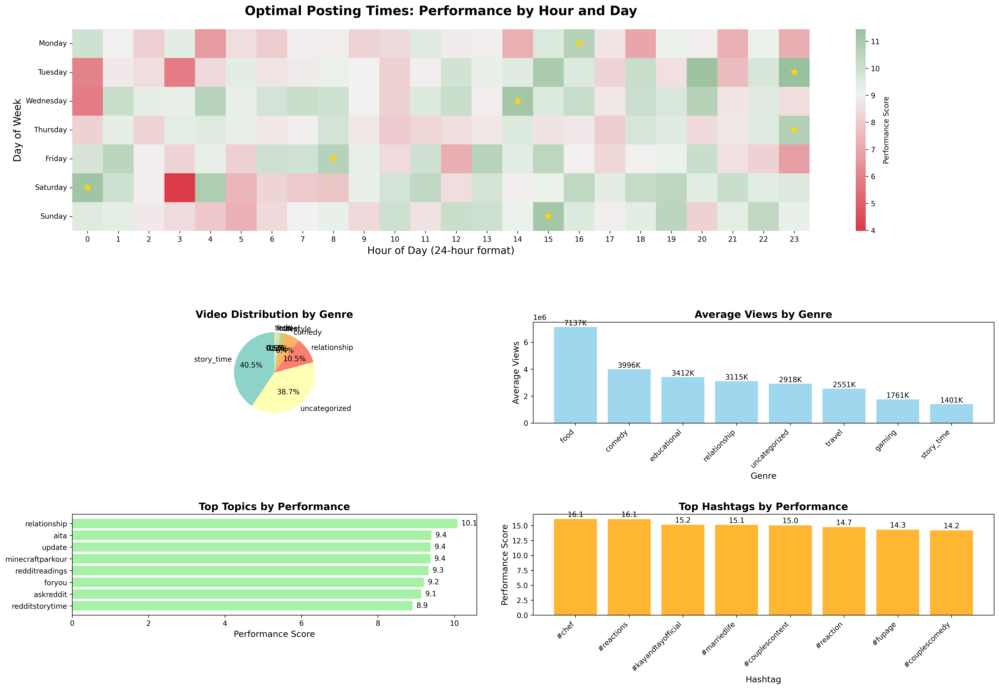
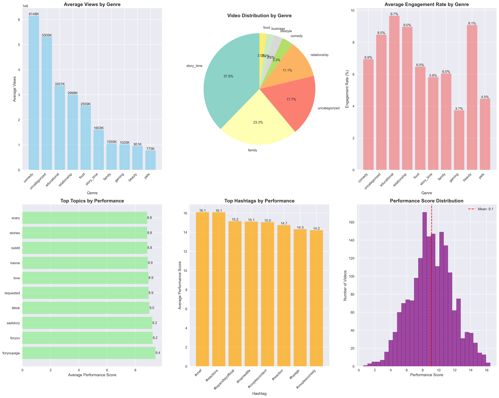
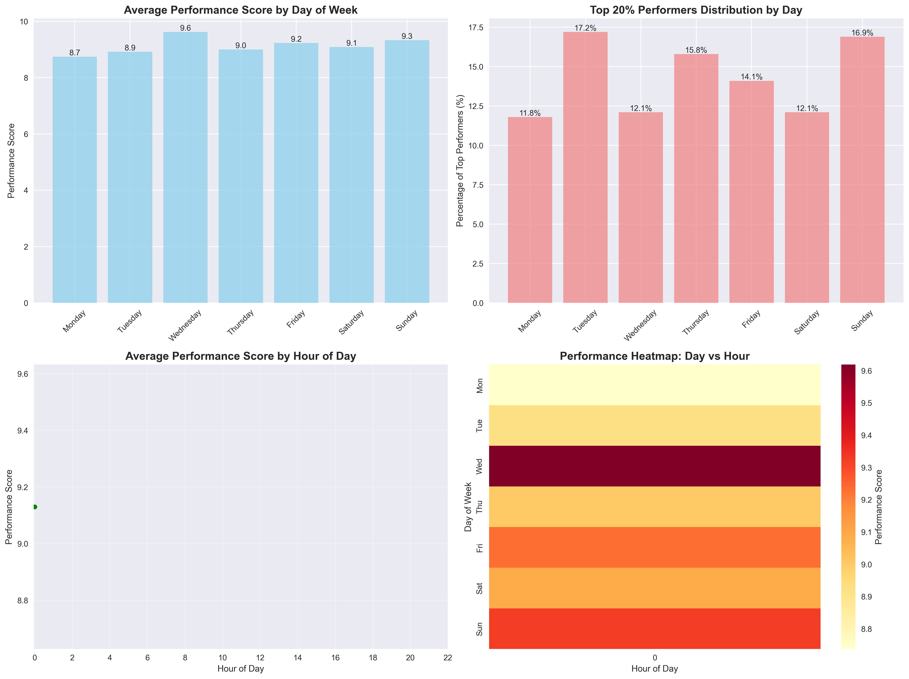

# TikTok Research & Analysis Suite
Complete toolkit for TikTok video collection, analysis, and performance prediction with AI-powered insights

## 1. main.py
> The main orchestrator for scraping TikTok videos into `master2.json` using URLs from `urls.txt`. It retrieves posts, transcriptions, metrics, and comments using multiple API calls, combining their strengths to create a comprehensive database for machine learning and data insights.

```bash
pip install -r requirements.txt
python main.py
```

To run with concurrent workers:
```bash
python main.py --workers 3
```

For other configurations:
```bash
python main.py --help
```

## 2. TikTok Insights Dashboard
> Comprehensive analysis suite that provides data-driven insights on optimal posting times, content performance by genre, and posting frequency strategies. Analyzes performance patterns from your scraped data to optimize TikTok strategy.

**Combined Dashboard:**


**Genre Performance Analysis:**


**Optimal Posting Times:**


```bash
cd tiktok_insights/scripts
python dashboard.py
```

Individual analysis scripts:
```bash
python optimal_posting_times.py    # Best times to post
python genre_performance.py        # Content category analysis  
python posting_frequency.py        # Optimal posting frequency
```

## 3. Keyword Scoring System
> AI-powered keyword extraction and scoring system that analyzes transcriptions and comments to identify high-performing keywords. Uses timing-aware scoring where keywords mentioned in the first 5 seconds get higher weights, helping optimize content for virality.

```bash
cd keyword_scoring_system
python keyword_scorer.py /path/to/master2.json --output results/
```

Generate clean keyword map:
```bash
python generate_keyword_map.py
```

View results:
```bash
cat keyword_score_map.txt
```

## 4. Performance Predictor
> Machine learning model that predicts TikTok video performance based on content analysis. Analyzes text, generates titles, and provides performance forecasts with viral potential scoring.

```bash
cd performance_predictor
python predict_performance.py "Your video content here"
```

From file:
```bash
python predict_performance.py --file content.txt --title "Custom Title"
```

API server:
```bash
python predictor_api.py
```

## 5. Video Analysis Suite
> Automated video transcription and virality analysis using Whisper AI. Processes video files to extract transcriptions, analyze content patterns, and score viral potential with detailed reporting.

```bash
cd video_analysis
python analyze_ubuntu_videos.py
```

Single video analysis:
```bash
python test_single_video.py /path/to/video.mp4
```

## 6. Reddit Integration
> Scrapes Reddit user profiles and discovers TikTok-related content. Extracts user activity, popular posts, and identifies potential TikTok content creators for research and analysis.

```bash
cd reddit_scraper
cp config.env.example config.env
# Edit config.env with your Reddit API credentials
python main.py --username <username> --max-posts 100
```

Batch processing:
```bash
python main.py --batch users.txt --format json
```

## 7. URL Collection Tools
> Browser-based URL harvesting from TikTok trending pages, hashtags, and user profiles. Includes both automated collection and manual browser extension options.

Automated harvesting:
```bash
cd scripts/collection
python url_harvester.py --trending --count 100
python browser_harvester.py  # Uses existing Firefox
```

Firefox extension:
```bash
cd firefox_extension
bash install_native_host.sh
# Load extension in Firefox developer mode
```

## 8. Data Processing & Cleanup
> Comprehensive suite of tools for cleaning, deduplicating, and processing scraped TikTok data. Includes JSON repair, duplicate removal, and data validation.

Remove duplicates:
```bash
cd scripts/cleanup
python remove_duplicates.py
python deduplicate.py urls.txt
```

Fix corrupted JSON:
```bash
python fix_json.py master2.json
python sanitize_json.py  # Extract videos with transcriptions
```

Clean data:
```bash
python clean_no_transcription.py  # Remove entries without transcriptions
```

## 9. Comment Extraction
> Extracts detailed comment data from TikTok videos including usernames, likes, and replies. Updates master database with comprehensive comment analysis for engagement insights.

```bash
cd scripts/collection
python update_comments_v2.py
python comment_extractor.py --video-url <url>
```

Batch comment extraction:
```bash
python master_download_and_comment.py --from-file urls.txt
```

## 10. Tool Launcher (ttools.py)
> Interactive menu system that provides easy access to all scraper tools and utilities. Shows descriptions, usage info, and launches scripts with proper error handling.

```bash
python ttools.py
```

Get help for specific tools:
```bash
python ttools.py --help
```

---

## 📊 Key Features

- **🎯 Advanced Analytics**: Optimal posting times, genre performance, frequency analysis
- **🤖 AI-Powered**: Keyword extraction, performance prediction, content analysis
- **📈 ML Models**: Virality scoring, engagement prediction, trend analysis  
- **🔄 Automation**: Batch processing, concurrent downloads, resume capability
- **🧹 Data Quality**: Duplicate removal, JSON repair, validation tools
- **📱 Multi-Platform**: TikTok + Reddit integration for comprehensive research
- **🎨 Visualizations**: Charts, heatmaps, dashboards for insights
- **⚡ Performance**: Multiprocessing, efficient data handling, optimized workflows

## 📁 Output Structure

```
master2.json           # Main database of all scraped videos
keyword_score_map.txt  # AI-generated keyword performance scores
tiktok_insights/       # Analysis reports and visualizations
├── outputs/           # JSON reports and data
└── charts/           # PNG visualizations and dashboards
models/               # Trained ML models for predictions
reddit_scraper/       # Reddit user profiles and content
video_analysis/       # Transcribed videos and analysis
```

## 🚀 Quick Start

1. **Setup Environment**:
   ```bash
   git clone <repository>
   cd tiktok_scraper
   pip install -r requirements.txt
   ```

2. **Collect Data**:
   ```bash
   # Add URLs to urls.txt, then:
   python main.py --workers 3
   ```

3. **Analyze Performance**:
   ```bash
   cd tiktok_insights/scripts
   python dashboard.py
   ```

4. **Generate Insights**:
   ```bash
   python generate_keyword_map.py
   cd performance_predictor && python predict_performance.py "content here"
   ```

## 📚 Documentation

Detailed documentation is available in the `documentation/` folder:
- [Implementation Summary](documentation/IMPLEMENTATION_SUMMARY.md)
- [AI/ML Research](documentation/AI_ML_Research_Document_v2.md)
- [Keyword Scoring Algorithm](documentation/keyword_scoring_algorithm_specification.md)
- [Usage Guides](documentation/)

---

**⚠️ Ethical Use Only**: This tool is for research, education, and content optimization. Respect platform terms of service and user privacy.